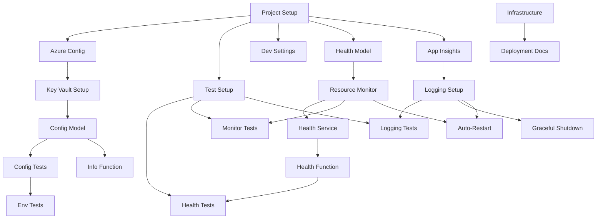

# Implementation Tasks: Village Club Service Scaffold

**Feature Branch**: `002-initial-scaffold-for`  
**Created**: 2025-10-12  
**Source**: [Specification](spec.md)

## Task Phases

### Phase 1: Project Setup

1. **T001**: Create Azure Functions project structure [Setup]
   - Create new Azure Functions project with .NET 8.0 Isolated Worker
   - Path: `src/VillageClub.Functions/VillageClub.Functions.csproj`
   - Dependencies: None

2. **T002**: Configure project for Azure Functions [Setup]
   - Add required NuGet packages for Azure Functions
   - Configure worker runtime and host settings
   - Add Azure Identity package for Key Vault
   - Path: `src/VillageClub.Functions/VillageClub.Functions.csproj`
   - Dependencies: T001

3. **T003**: Setup test project [Setup]
   - Create test project with xUnit
   - Add test dependencies and Azure Functions testing tools
   - Add Azure.Identity.Mock for testing
   - Path: `tests/VillageClub.Functions.Tests/VillageClub.Functions.Tests.csproj`
   - Dependencies: T001

4. **T004**: Create local development settings [Setup]
   - Create local.settings.json with development configuration
   - Configure Azure Storage Emulator connection
   - Add Key Vault configuration placeholders
   - Setup environment-specific variables
   - Path: `src/VillageClub.Functions/local.settings.json`
   - Dependencies: T001

5. **T005**: Setup Azure Key Vault access [Setup]
   - Create Key Vault configuration provider
   - Add managed identity configuration
   - Configure secret client
   - Path: `src/VillageClub.Functions/Configuration/KeyVaultConfig.cs`
   - Dependencies: T002

### Phase 2: Foundational Components

6. **T006**: Implement configuration model [P]
   - Create ServiceSettings class with validation
   - Add environment variable binding
   - Implement configuration validation
   - Path: `src/VillageClub.Functions/Configuration/ServiceSettings.cs`
   - Dependencies: T005

7. **T007**: Implement configuration tests [P]
   - Test environment variable loading
   - Validate Key Vault integration
   - Test configuration validation
   - Path: `tests/VillageClub.Functions.Tests/Configuration/ServiceSettingsTests.cs`
   - Dependencies: T006

8. **T008**: Implement health model [P]
   - Create HealthStatus class and related models
   - Add resource usage tracking
   - Add memory monitoring thresholds
   - Path: `src/VillageClub.Functions/Health/Models/HealthStatus.cs`
   - Dependencies: T001

9. **T009**: Setup Application Insights integration [P]
   - Configure Application Insights for telemetry
   - Add correlation tracking
   - Setup performance counters
   - Configure resource monitoring
   - Path: `src/VillageClub.Functions/Program.cs`
   - Dependencies: T001

10. **T010**: Implement resource monitoring [P]
    - Create resource monitoring service
    - Add memory usage tracking
    - Configure auto-restart thresholds
    - Path: `src/VillageClub.Functions/Monitoring/ResourceMonitor.cs`
    - Dependencies: T008

### Phase 3: User Story 1 - Basic Service Health Check

11. **T011**: Implement health service
    - Create HealthService for status monitoring
    - Integrate with ResourceMonitor
    - Add cleanup operations
    - Path: `src/VillageClub.Functions/Health/HealthService.cs`
    - Dependencies: T010

12. **T012**: Create health check function [P]
    - Implement HTTP-triggered health check endpoint
    - Add memory and uptime metrics
    - Include resource status
    - Path: `src/VillageClub.Functions/Functions/HealthFunction.cs`
    - Dependencies: T011

13. **T013**: Implement health check tests [P]
    - Add unit tests for health service
    - Test resource monitoring integration
    - Add integration tests for health endpoint
    - Path: `tests/VillageClub.Functions.Tests/Health/HealthServiceTests.cs`
    - Dependencies: T003, T012

14. **T014**: Add resource monitoring tests [P]
    - Test memory usage tracking
    - Validate auto-restart triggers
    - Test cleanup operations
    - Path: `tests/VillageClub.Functions.Tests/Monitoring/ResourceMonitorTests.cs`
    - Dependencies: T003, T010

**[CHECKPOINT]** User Story 1 Complete:
- Health check endpoint operational
- Basic metrics exposed
- Tests passing

### Phase 4: User Story 2 - Service Logging Setup

15. **T015**: Configure structured logging
    - Setup Application Insights logging
    - Configure correlation tracking
    - Add resource monitoring events
    - Path: `src/VillageClub.Functions/Program.cs`
    - Dependencies: T009

16. **T016**: Implement info function [P]
    - Create HTTP-triggered info endpoint
    - Return service configuration and status
    - Include environment variable configuration
    - Path: `src/VillageClub.Functions/Functions/InfoFunction.cs`
    - Dependencies: T006

17. **T017**: Add logging tests [P]
    - Test App Insights integration
    - Verify correlation tracking
    - Test resource monitoring events
    - Path: `tests/VillageClub.Functions.Tests/LoggingTests.cs`
    - Dependencies: T003, T015

18. **T018**: Add environment config tests [P]
    - Test environment variable overrides
    - Validate configuration hierarchy
    - Test Key Vault fallback
    - Path: `tests/VillageClub.Functions.Tests/Configuration/EnvironmentConfigTests.cs`
    - Dependencies: T007

**[CHECKPOINT]** User Story 2 Complete:
- Structured logging operational
- Service info endpoint available
- Logging tests passing

### Final Phase: Polish & Integration

19. **T019**: Create infrastructure templates
    - Create Bicep templates for Azure resources
    - Add Key Vault setup
    - Configure managed identity
    - Path: `infrastructure/main.bicep`
    - Dependencies: None [P]

20. **T020**: Add deployment documentation
    - Update quickstart guide with Azure deployment steps
    - Add Key Vault setup instructions
    - Add environment configuration guide
    - Add troubleshooting guide
    - Path: `docs/deployment.md`
    - Dependencies: T019

21. **T021**: Implement graceful shutdown
    - Add shutdown coordination
    - Ensure proper resource cleanup
    - Log shutdown events
    - Path: `src/VillageClub.Functions/Program.cs`
    - Dependencies: T015

22. **T022**: Configure auto-restart policy
    - Setup resource threshold monitoring
    - Configure cleanup operations
    - Add restart logging
    - Path: `src/VillageClub.Functions/Monitoring/RestartPolicy.cs`
    - Dependencies: T010, T015

## Dependencies

## Parallel Execution Examples

### Setup Phase (Parallel):
- Team Member 1: T001, T002, T004
- Team Member 2: T003, T005
- Team Member 3: T006, T007, T008
- Team Member 4: T009, T010

### User Story 1 (Parallel):
- Team Member 1: T011, T012
- Team Member 2: T013
- Team Member 3: T014

### User Story 2 (Parallel):
- Team Member 1: T015, T016
- Team Member 2: T017, T018

### Polish Phase (Parallel):
- Team Member 1: T019, T020
- Team Member 2: T021, T022

## Implementation Strategy

1. **MVP Scope**: User Story 1 (Health Check)
   - Delivers immediate value through service health monitoring
   - Enables early validation of Azure Functions setup
   - Includes resource monitoring and auto-restart
   - Foundation for future feature development

2. **Incremental Delivery**:
   - Phase 1: Project setup and Key Vault integration
   - Phase 2: Core components and resource monitoring
   - Phase 3: Health monitoring with auto-restart (US1)
   - Phase 4: Logging and environment configuration (US2)
   - Final Phase: Production readiness and deployment

3. **Testing Strategy**:
   - Unit tests for services and models
   - Integration tests for Function endpoints
   - Environment configuration testing
   - Resource monitoring validation
   - Logging and telemetry verification
   - Infrastructure validation

## Task Summary

- Total Tasks: 22
- User Story 1 Tasks: 4
- User Story 2 Tasks: 4
- Parallel Opportunities: 12 tasks can be executed in parallel
- Independent Test Criteria: 2 checkpoints
- Suggested MVP: User Story 1 (Tasks T011-T014)